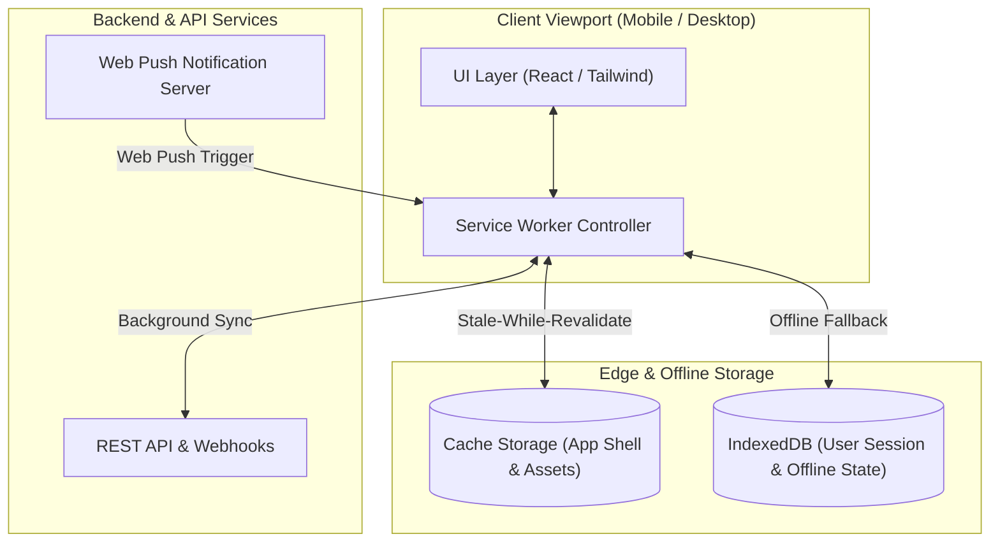

# 📱 High-Conversion Progressive Web App (PWA) & Mobile Framework

A lightweight, mobile-first Progressive Web Application (PWA) architecture designed for high-conversion user onboarding, offline caching, push notifications, and sub-second rendering across mobile viewports.

---

## 🏛️ PWA Lifecycle & Caching Architecture

---

## ✨ Key Technical Capabilities

1. **Sub-Second First Contentful Paint (FCP):** Optimized critical rendering path with code-splitting and asset prefetching (98+ Google Lighthouse Performance Score).
2. **Offline-First Resilience:** Stale-While-Revalidate caching strategies managed by modern Service Workers with automatic cache invalidation.
3. **Web Push & Engagement:** Native-feel push notification subscriptions and background synchronization pipelines.
4. **Adaptive Mobile UX:** Touch gestures, responsive bottom sheets, and native app install prompts (A2HS).

---

## 🛠️ Tech Stack

- **Frontend & PWA:** React.js, TypeScript, Vite, Tailwind CSS, Workbox / Service Workers
- **State & Storage:** IndexedDB (idb), LocalStorage, Cache API
- **Deployment & Edge:** Nginx, Docker, Cloudflare CDN

---

## 👨‍💻 Author & Engineering
- **Author:** [Yevhen Shaforostov](https://github.com/yevhens-hue)
- **Role:** AI Product Manager & Full-Stack AI Engineer at [Adsy.com](https://adsy.com)

<!-- activity-sync: 2026-08-28 -->

<!-- activity-sync: 2026-08-28 -->

<!-- activity-sync: 2026-08-29 -->
